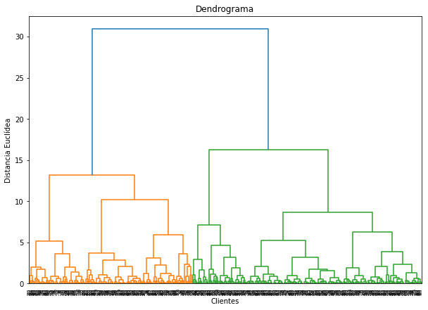
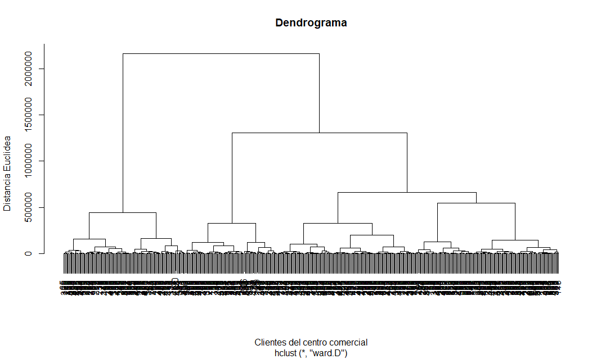
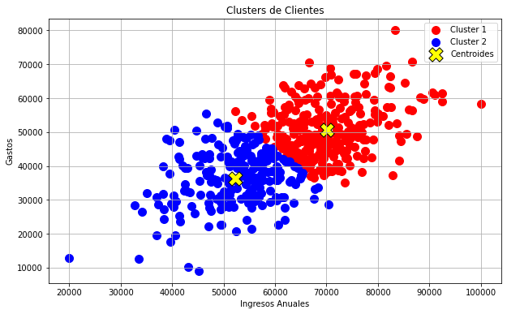
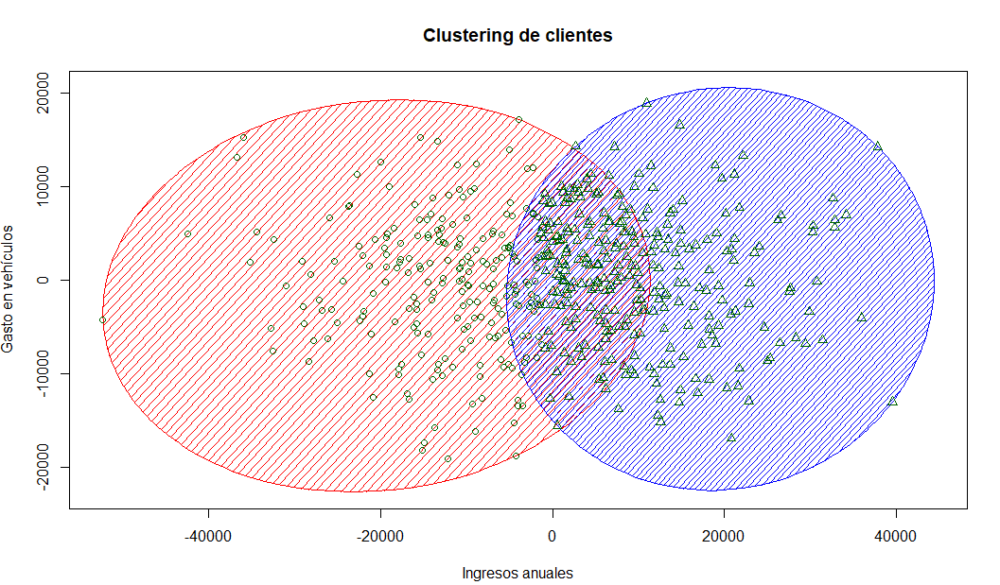

# Segmentación de Clientes para Concesionario de Coches Clustering Jerárquico Machine learning


## Tabla de Contenidos
- [Descripción](#descripción)
- [Tecnologías Utilizadas](#tecnologías-utilizadas)
- [Características del Proyecto](#características-del-proyecto)
- [Instalación](#instalación)
- [Uso](#uso)
- [Visualizaciones](#visualizaciones)
- [conclusiones](#conclusiones)
- [Licencia](#licencia)
- [Licencia](#licencia)

## Descripción

Este proyecto busca segmentar a los compradores de automóviles de una ciudad utilizando Clustering Jerárquico, basado en dos características clave: Ingresos Anuales y Gastos en Vehículos. La segmentación permite identificar grupos con patrones de compra similares, lo que ayuda a diseñar estrategias de marketing más efectivas y personalizadas, optimizando los recursos y mejorando las tasas de conversión.
Se emplea Clustering Jerárquico Aglomerativo, que agrupa los datos en una estructura jerárquica. Para determinar el número óptimo de clusters, se utiliza un dendrograma, un gráfico en forma de árbol que muestra las fusiones de los clusters. El número adecuado de clusters se identifica al cortar el dendrograma en el punto donde se observa un salto notable en la altura, lo que indica una separación natural en los datos.  
## Tecnologías Utilizadas

- **Lenguajes de Programación:**
  - Python 3.12
  - R 3.6.3
- **Entornos de Desarrollo:**
  - Spyder 5
  - RStudio
- **Librerías y Paquetes:**
  - Python:
    - NumPy
    - Pandas
    - Matplotlib
    - Seaborn
    - Scikit-learn
    - Chardet
  - R:
    - readr
    - ggplot2
    - cluster
    - factoextra
    - dplyr

## Características del Proyecto

- **Carga y Limpieza de Datos:**
  - Detección automática de la codificación del archivo CSV.
  - Manejo de valores faltantes mediante eliminación de filas incompletas.
- **Selección de Características:**
  - Análisis basado en **Ingresos Anuales** y **Gastos en Vehículos**.
- **Determinación del Número Óptimo de Clusters:**
  - Uso de un dendrograma para identificar visualmente el número adecuado de clusters.
  - Evaluación del Coeficiente de Silueta para validar la calidad de los clusters.
- **Aplicación del Algoritmo de Clustering Jerárquico:**
  - Segmentación de clientes mediante Clustering Jerárquico Aglomerativo.
- **Visualización de Clusters:**
  - Boxplots para analizar la distribución de características por cluster.
- **Análisis Descriptivo de Clusters:**
  - Estadísticas descriptivas para cada segmento de clientes.

## Instalación
```bash
git clone https://github.com/moises60/Clustering-Jer-rquico-Machine-learning.git
```
## Visualizaciones
# Método del Codo


# Dendrograma



# Clusters de Clientes Python


# Clusters de Clientes R


# conclusiones 
Clientes Estandar: Representan una base sólida de clientes con ingresos y gastos equilibrados, ideales para ofertas estándar.
Clientes Objetivo: Son los clientes de alto valor con mayores ingresos y gastos, perfectos para promociones de vehículos de gama alta o servicios premium.

# Licencia
El dataset está licenciado bajo la [Licencia Apache 2.0](LICENSE).
(https://www.kaggle.com/code/faraahanwaaar/car-sales-price-prediction/notebook)
